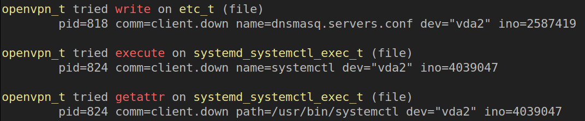

# avcs
Small wrapper around ausearch to make SELinux AVCs easier to read

# Usage
All command line flags are passed to ausearch, apart from --stdin.
With this flag you can paste AVCs in the tool instead of getting them via ausearch.
If you get the AVCs from ausearch you'll need to run this as root.

## Examples
`avcs.rb`
will analyze all AVCs in the audit log

`avcs.rb -ts recent`
will analyze only recent AVCS

`avcs.rb --stdin`
will read AVCs from STDIN until EOF and use those

## Run as container
If your system doesn't have ruby you can build a container with the provided Dockerfile. E.g.
`podman build . -t avc`
then run it
`podman run --privileged -v /var/log/audit/:/var/log/audit avc -ts recent`
